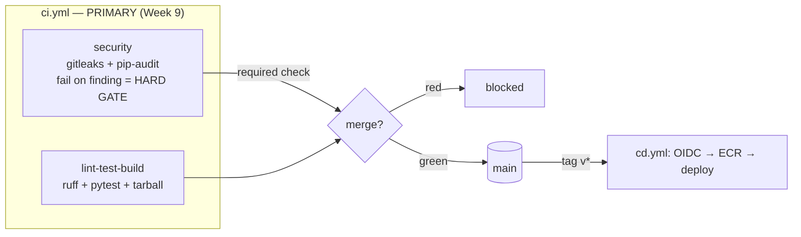

# Module: cicd-pipelines

> **Status:** Validated — every local gate in `./validate.sh` passes in this
> environment (31 PASS, 0 FAIL): YAML parse for all workflows, job-graph check,
> workflow unit tests, the **Flask app `py_compile` + `pytest`** gate, a real
> `docker build` + `/health` smoke test, **`actionlint` on all six GitHub Actions
> workflows + the broken fixture**, and **`yamllint`** on the GitLab CI files and
> the workflows. The `actionlint`/`yamllint`/`docker`/`pytest` gates are guarded
> by `command -v` (run where the tool exists, skip cleanly where it does not).
> `ruff`, `gitleaks`, the live `pip-audit` SCA run, `glab ci lint`, `hadolint`,
> and the live `trivy` image scan remain **DEFERRED** — those tools are not
> installed here; the exact commands are documented below and wired into the
> workflows so they run in real CI.
> **Maps to:** **Week 09 Class 01–02** — `ci.yml` is the EXACT Class-1 lecture
> pipeline (ruff → pytest → tarball artifact + gitleaks/pip-audit security gate);
> `cd.yml` is the Class-2 OIDC deploy. **Week 19 Class 02–03** reuses the advanced
> supply-chain variant (`ci-advanced.yml`: container build + Trivy image scan).

## Which file maps to the Week 9 lecture

| File | What it is | Maps to |
|------|-----------|---------|
| **`solution/.github/workflows/ci.yml`** | **PRIMARY — the Week 9 Class 1 pipeline, verbatim:** `lint (ruff) → test (pytest) → build a SHA-tagged tarball artifact`, plus a separate **security gate** that runs **gitleaks** (secret scan) and **pip-audit** (SCA) and **fails the build on a finding**. | **W9 C1** (lecture demo + student lab) |
| `solution/.github/workflows/cd.yml` | Deploy on `v*` tags via **OIDC** (no static keys) → ECR → `production` environment with required reviewers. | **W9 C2** (CD half) |
| `solution/.github/workflows/ci-advanced.yml` | **ADVANCED variant** — builds the container **image** and runs a hard **Trivy** image scan (`exit-code: 1`) as the supply-chain gate. **Not** the Week 9 lecture; the Week 19 depth. | **W19 C2–C3** |
| `solution/.gitlab-ci.yml` | GitLab mirror of the advanced (image + Trivy) pipeline, for a platform comparison. | W9 (portability) / W19 |

If you only do Week 9, the file you build is **`ci.yml`**. `ci-advanced.yml` is a
stretch/Week-19 file.

## What you will build

A small **Flask** service (`app/main.py` — one pure `add()` function and a
`/health` endpoint) and the CI/CD around it, expressed several ways:

- **`ci.yml`** (PRIMARY, Week 9) — on every push to `main` and every PR:
  `lint-test-build` (ruff lint → pytest across Python 3.11 + 3.12 → build a
  **real, SHA-tagged tarball** `dist/app-${GITHUB_SHA::7}.tar.gz` and upload it)
  and a separate **`security`** job that runs **gitleaks** and **pip-audit**.
  Both security tools **exit non-zero on a finding**, which fails the job and the
  required status check — so a leaked secret or a vulnerable dependency
  **cannot be merged**. There is no `|| true` and no `continue-on-error`.
- **`cd.yml`** — a deploy pipeline triggered only on `v*` tags that authenticates
  to AWS with **OIDC** (`id-token: write` + `configure-aws-credentials` with
  `role-to-assume`, **no long-lived keys**), pushes to ECR, and deploys behind a
  `production` environment with required reviewers.
- **`ci-advanced.yml`** (Week 19 depth) — `lint → test → build IMAGE → scan` with
  a **hard Trivy image gate** (`exit-code: "1"` on HIGH/CRITICAL). Same hard-gate
  discipline, applied to the container artifact instead of the source.
- **`.gitlab-ci.yml`** — the GitLab mirror of the advanced pipeline
  (`lint/test/build/scan/deploy`) with the scan stage using Trivy and
  `allow_failure: false` — the GitLab equivalent of the hard gate.

The build target is the same tiny Flask app you **containerize in Week 10**.

## Prerequisites

- `python3 >= 3.10` with **PyYAML** (`python3 -c "import yaml"` must succeed) and,
  for the app test gate, **Flask** + **pytest** (`pip install -r
  solution/requirements-dev.txt`). The app `py_compile` gate runs without Flask.
- `docker >= 24` — for the optional local build + `/health` smoke test (skipped
  gracefully if absent).
- `bash >= 5`.
- `actionlint` and `yamllint` — run as local gates by `validate.sh` when present
  (guarded by `command -v`, so they skip cleanly if not installed).
- For the deferred gates, where available: `ruff`, `gitleaks`, `pip-audit`,
  `glab`, `hadolint`, `trivy` (commands below).
- Accounts/access: **none** to do the lab locally. To actually run `cd.yml` you
  need an AWS account with an IAM role trusting GitHub's OIDC provider and an ECR
  repo — documented but **not required** and **costs nothing** until you wire it up.
- Feeds the container work in `docker-containers` (W10) and the deploy targets used
  by `kubernetes-fundamentals` (W11/12) and the capstone.

## Architecture

See [`docs/architecture.mmd`](docs/architecture.mmd) (Mermaid). In words: a PR runs
the **PRIMARY** `ci.yml` — `lint-test-build` in parallel with the `security` job.
The `security` check is **required** by branch protection, so a gitleaks or
pip-audit finding (red `security` check) **blocks the merge**. Once merged and
tagged `vX.Y.Z`, `cd.yml` assumes an AWS role via OIDC, pushes the image to ECR,
waits for a required reviewer on `production`, then rolls the ECS service. The
advanced `ci-advanced.yml` adds a container build + Trivy image scan.



## Repository layout

```
starter/    # intentionally incomplete — you add the security gate (and the OIDC creds)
  .github/workflows/ci.yml            # PRIMARY: lint-test-build done; `security` job is TODO
  .github/workflows/ci-advanced.yml   # ADVANCED: scan job + build `needs:` are TODO
  .github/workflows/cd.yml            # OIDC permissions + configure-aws-credentials TODO
  .gitlab-ci.yml                      # complete reference (compare against your work)
  app/, tests/, requirements*.txt     # the Flask service under test (complete)
solution/   # reference implementation — check yourself against this
  .github/workflows/ci.yml            # full ruff/pytest/tarball + gitleaks/pip-audit gate
  .github/workflows/ci-advanced.yml   # image build + hard Trivy gate (W19 depth)
  .github/workflows/cd.yml            # OIDC → ECR → production deploy
  .gitlab-ci.yml                      # five-stage mirror with allow_failure:false gate
  app/main.py, app/__init__.py        # the Flask app
  app/Dockerfile, app/.dockerignore   # container image (W10 + advanced variant)
  tests/test_main.py                  # pytest unit tests
  requirements.txt                    # runtime deps (flask) — pip-audit scans this
  requirements-dev.txt                # pytest + ruff + pip-audit
tests/      # check_job_graph.py (the needs-graph gate) + test_workflows.py
broken/     # ci-bad-needs.yml — a real broken workflow for the troubleshooting drill
docs/       # architecture.mmd
validate.sh # runs every local gate; exits non-zero on any failure
```

## Setup

From a fresh clone:

```bash
cd labs/cicd-pipelines
python3 -c "import yaml; print('PyYAML', yaml.__version__)"      # sanity check
pip install -r solution/requirements-dev.txt                    # for the pytest gate
./validate.sh                                                   # run all local gates
```

To do the lab, edit files under `starter/` and re-run the checks (the graph
checker and tests take explicit paths — see each task).

## Lab tasks

1. **Run the app locally first.**
   `cd solution && pip install -r requirements-dev.txt && ruff check . && pytest -q`.
   **Done when:** `2 passed`/`3 passed` and `All checks passed!` print locally —
   you trust the pipeline only after it is green on your machine.

2. **Add the `security` gate (the headline task).**
   In `starter/.github/workflows/ci.yml`, add the `security` job:
   checkout with `fetch-depth: 0`, run `gitleaks/gitleaks-action@v2`
   (with `GITHUB_TOKEN`), set up Python, then `pip install pip-audit==2.7.3` and
   `pip-audit -r requirements.txt`. **Do not** add `continue-on-error` or `|| true`.
   **Done when:** `TestCiSecurityGate` in `tests/test_workflows.py` passes against
   your file (copy your finished `ci.yml` over `solution/.github/workflows/ci.yml`
   in a scratch copy, or adapt the test paths) and `actionlint` is clean.

3. **Make the CD deploy use OIDC, not keys.**
   In `starter/.github/workflows/cd.yml`, set the deploy job's `permissions:` to
   `id-token: write` + `contents: read`, and add a `Configure AWS credentials`
   step using `aws-actions/configure-aws-credentials@v4` with
   `role-to-assume: ${{ secrets.AWS_DEPLOY_ROLE_ARN }}`. No `aws-access-key-id`.
   **Done when:** `TestCdOidc` passes and
   `grep -n "aws-access-key-id" starter/.github/workflows/cd.yml` finds nothing
   in a `with:` block.

4. **(Stretch / Week 19) Add the Trivy image gate.**
   In `starter/.github/workflows/ci-advanced.yml`, wire `build` with `needs: [test]`
   and add the `scan` job (`needs: [build]`, `security-events: write`,
   `aquasecurity/trivy-action@0.28.0` with `severity: HIGH,CRITICAL`,
   `ignore-unfixed: true`, `exit-code: "1"`, SARIF upload `if: always()`).
   **Done when:** `TestCiAdvancedScanGate` passes and `check_job_graph.py` is green.

5. **Run the full local suite.**
   **Done when:** `./validate.sh` exits `0` with all gates `[PASS]`.

6. **Troubleshooting drill.** Fix `broken/ci-bad-needs.yml` (see Troubleshooting).
   **Done when:** `python3 tests/check_job_graph.py broken/ci-bad-needs.yml` is green
   after your edit (work on a copy so the fixture stays broken for the next learner).

## How the scan gate actually blocks a merge

A "scan" that only prints findings is theater. Two things must both be true.

1. **The job must fail on a finding.**
   - In the **PRIMARY** `ci.yml`, `gitleaks` and `pip-audit` already **exit
     non-zero** on a finding by default — `gitleaks` when it finds a committed
     credential, `pip-audit` when a pinned dependency has a known CVE. The gate is
     hard simply because there is **no** `continue-on-error: true` and **no**
     `|| true` swallowing the exit code. Add either and the gate silently dies.
   - In the **ADVANCED** `ci-advanced.yml`, Trivy returns non-zero only when you
     pass `exit-code: "1"`. With the default `exit-code: 0`, Trivy prints CVEs and
     **still exits 0**, so a vulnerable image sails through:
     ```yaml
     - uses: aquasecurity/trivy-action@0.28.0
       with:
         severity: HIGH,CRITICAL   # only fail on these
         ignore-unfixed: true      # don't block on CVEs with no patch yet
         exit-code: "1"            # <-- non-zero exit => job FAILS
     ```

2. **The failing job must be a *required* status check.** A failing job only blocks
   a merge if branch protection makes it required. In the repo's **Settings →
   Branches → branch protection rule for `main`**, enable *"Require status checks to
   pass before merging"* and select the **`security`** check (Week 9) — and the
   `scan` check if you use the advanced variant. GitHub then disables the merge
   button until the check is green.

On **GitLab** the same gate is `allow_failure: false` on the `scan:trivy` job plus
*"Pipelines must succeed"* in **Settings → Merge requests**. With
`allow_failure: true` the pipeline goes green even when Trivy exits 1 — the GitLab
footgun this module makes you avoid.

## Validation

`./validate.sh` runs the gates below. Real output captured in **this** environment:

```
== validating cicd-pipelines ==
  [PASS] yaml parses: solution/.github/workflows/ci.yml
  [PASS] yaml parses: solution/.github/workflows/ci-advanced.yml
  [PASS] yaml parses: solution/.github/workflows/cd.yml
  [PASS] yaml parses: solution/.gitlab-ci.yml
  [PASS] yaml parses: starter/.github/workflows/ci.yml
  [PASS] yaml parses: starter/.github/workflows/ci-advanced.yml
  [PASS] yaml parses: starter/.github/workflows/cd.yml
  [PASS] yaml parses: broken/ci-bad-needs.yml
  [PASS] job graph valid: solution ci.yml + ci-advanced.yml + cd.yml
  [PASS] job graph gate REJECTS broken/ci-bad-needs.yml (expected)
  [PASS] workflow unit tests (unittest)
  [PASS] python compiles: solution/app/main.py
  [PASS] python compiles: solution/app/__init__.py
  [PASS] app unit tests (pytest)
  [PASS] docker build + /health smoke test (solution/app)
  [PASS] actionlint: solution/.github/workflows/ci.yml
  [PASS] actionlint: solution/.github/workflows/ci-advanced.yml
  [PASS] actionlint: solution/.github/workflows/cd.yml
  [PASS] actionlint: starter/.github/workflows/ci.yml
  [PASS] actionlint: starter/.github/workflows/ci-advanced.yml
  [PASS] actionlint: starter/.github/workflows/cd.yml
  [PASS] actionlint REJECTS broken/ci-bad-needs.yml (expected)
  [PASS] yamllint: solution/.gitlab-ci.yml
  [PASS] yamllint: starter/.gitlab-ci.yml
  [PASS] yamllint: solution/.github/workflows/ci.yml
  [PASS] yamllint: solution/.github/workflows/ci-advanced.yml
  [PASS] yamllint: solution/.github/workflows/cd.yml
  [PASS] yamllint: starter/.github/workflows/ci.yml
  [PASS] yamllint: starter/.github/workflows/ci-advanced.yml
  [PASS] yamllint: starter/.github/workflows/cd.yml
  [PASS] yamllint: broken/ci-bad-needs.yml
  [DEFERRED] ruff check .                          (Python lint; pip install ruff==0.8.4)
  [DEFERRED] gitleaks detect --no-git              (secret scan; runs in ci.yml security job)
  [DEFERRED] pip-audit -r requirements.txt         (SCA; needs python3-venv to resolve)
  [DEFERRED] glab ci lint                          (GitLab pipeline lint; needs a GitLab project)
  [DEFERRED] hadolint app/Dockerfile               (run where hadolint is installed)
  [DEFERRED] trivy image ... --exit-code 1         (advanced variant; run where Trivy + an image exist)
== 31 passed, 0 failed (plus 6 DEFERRED — see README) ==
```

> Where a guarded tool is absent the line becomes a single `[SKIP] …` and the
> total drops accordingly — the suite still exits `0`.

### Gate commands

| Gate | Command (this repo) | Status here |
|------|---------------------|-------------|
| YAML well-formed (×8) | `python3 -c "import yaml,sys; list(yaml.safe_load_all(open(F)))"` | PASS |
| Job-graph: every `needs` resolves, acyclic | `python3 tests/check_job_graph.py solution/.github/workflows/ci.yml solution/.github/workflows/ci-advanced.yml solution/.github/workflows/cd.yml` | PASS |
| Broken fixture is rejected | `! python3 tests/check_job_graph.py broken/ci-bad-needs.yml` | PASS |
| Workflow invariants (gitleaks+pip-audit gate, Trivy gate, OIDC, no keys) | `python3 -m unittest discover -s tests` | PASS (24 tests) |
| Flask app compiles | `python3 -m py_compile solution/app/main.py solution/app/__init__.py` | PASS |
| Flask app unit tests | `cd solution && pytest -q` | PASS (3 passed) |
| Image builds + serves `/health` | `docker build -t app solution/app && docker run ... /health` | PASS (~184 MB image, HTTP 200) |
| GitHub Actions static analysis (×6 workflows) | `actionlint solution/.github/workflows/*.yml starter/.github/workflows/*.yml` | PASS (`actionlint 1.7.3`, 0 errors; runs `shellcheck` on `run:` steps) |
| actionlint rejects the broken fixture | `! actionlint broken/ci-bad-needs.yml` | PASS (flags both dangling `needs`) |
| YAML lint (relaxed, CI-idiomatic) | `yamllint -c .yamllint.yml <gitlab + workflow files>` | PASS (`yamllint 1.38.0`, 0 errors) |

### Lint gates — PASSING in this environment (real output)

```console
$ actionlint --version
1.7.3
$ actionlint solution/.github/workflows/ci.yml solution/.github/workflows/ci-advanced.yml \
             solution/.github/workflows/cd.yml starter/.github/workflows/*.yml
$ echo $?
0            # no output, exit 0 = clean (shellcheck of run: steps included)

# The broken fixture is correctly REJECTED (the expected teaching outcome):
$ actionlint broken/ci-bad-needs.yml
broken/ci-bad-needs.yml:24:3: job "test" needs job "unit" which does not exist in this workflow [job-needs]
broken/ci-bad-needs.yml:38:3: job "scan" needs job "buld" which does not exist in this workflow [job-needs]
$ echo $?
1            # validate.sh inverts this: PASS == "correctly detected"

$ yamllint --version
yamllint 1.38.0
$ yamllint -c .yamllint.yml solution/.gitlab-ci.yml solution/.github/workflows/*.yml ...
$ echo $?
0            # clean under the relaxed CI-idiomatic ruleset in .yamllint.yml
```

### Still-DEFERRED gates — exact commands to run where the tool exists

These are wired into the workflows and run in real CI; the tools are not installed
in this build environment (no network resolver / not present), so they are honestly
DEFERRED, not PASS:

```bash
# Python lint (also the `ruff check .` step in ci.yml):
ruff check solution

# Secret scan (the gitleaks step in ci.yml — fails on a committed credential):
gitleaks detect --source solution --no-git

# Dependency/SCA scan (the pip-audit step in ci.yml). In CI this resolves cleanly;
# locally here it needs python3-venv to build the resolver environment:
cd solution && pip-audit -r requirements.txt

# GitLab pipeline lint (needs a GitLab project context / token):
glab ci lint --path solution/.gitlab-ci.yml

# Dockerfile lint (also runs as a CI job via hadolint-action):
hadolint solution/app/Dockerfile

# The advanced image gate (must exit 1 on HIGH/CRITICAL):
docker build -t app solution/app
trivy image --severity HIGH,CRITICAL --ignore-unfixed --exit-code 1 app
```

## Expected results

- `./validate.sh` exits `0`; every line is `[PASS]` (plus the 6 `[DEFERRED]`
  notes).
- `pytest -q` from `solution/` → `3 passed`. `ruff check .` → `All checks passed!`.
- `check_job_graph.py` prints `[PASS] ci.yml: job graph valid (...)` for the
  solution and `[FAIL] ... not a defined job` for the broken fixture.
- The image is ~**184 MB**; `GET /health` → `200` with body
  `{"status": "ok", "version": "1.0.0"}`.
- In real CI: a PR that commits a secret shows a **red `security` check** (gitleaks)
  and a disabled merge button; a PR that adds a vulnerable dependency shows the same
  via pip-audit.

## Troubleshooting

Reproducible broken state ships in [`broken/ci-bad-needs.yml`](broken/ci-bad-needs.yml).

| Symptom | Cause | Fix |
|---------|-------|-----|
| GitHub UI: *"Job 'scan' depends on unknown job 'buld'"* and the workflow never starts. `python3 tests/check_job_graph.py broken/ci-bad-needs.yml` prints two `[FAIL]` lines. | Typo'd / dangling `needs:` — `scan` needs `buld` (should be `build`) and `test` needs a non-existent `unit` job. | Correct the job names in each `needs:` list so they reference defined jobs. Re-run the checker until green. |
| `ModuleNotFoundError: No module named 'app'` in pytest. | pytest run from the wrong directory, or `app/__init__.py` is missing. | Run `pytest` from the **repo root** (the `solution/` dir here) so `from app.main import ...` resolves; confirm `app/__init__.py` exists. |
| gitleaks job errors immediately / scans nothing. | Missing `fetch-depth: 0` on the checkout step — gitleaks needs full history. | Add `with: { fetch-depth: 0 }` to the `actions/checkout` step in the `security` job. |
| `security` job is green even though a secret/CVE is present. | The gate was softened: someone added `continue-on-error: true` or `\|\| true`. | Remove the soft-fail. gitleaks and pip-audit already exit non-zero on a finding. |
| Trivy step (advanced) is green even though the image has known CVEs. | Soft gate: `exit-code` left at `0`. | Set `exit-code: "1"`, remove any soft-fail. |
| Merge button is enabled despite a red `security` job. | The `security` check is not a *required* status check in branch protection. | Add `security` under Settings → Branches → Require status checks. |
| `cd.yml` fails with `Credentials could not be loaded` / `Not authorized to perform sts:AssumeRoleWithWebIdentity`. | Missing `permissions: id-token: write`, or the IAM role's trust policy doesn't allow GitHub's OIDC provider / this repo+ref. | Add the `id-token: write` permission and fix the role trust policy's `sub` condition. |
| PyYAML test for `on:` triggers fails with `KeyError`. | YAML 1.1 (PyYAML) parses the bare key `on:` as the boolean `True`, not the string `"on"`. | Look it up as `data.get(True)` (the test already does this) — a real GitHub-config gotcha. |

## Cleanup

Local-only. The lab creates **no cloud resources** by default. The optional docker
gate cleans up after itself, but to be safe:

```bash
docker rmi cicd-pipelines-validate:local 2>/dev/null || true
find . -name '__pycache__' -type d -prune -exec rm -rf {} +
rm -rf solution/dist starter/dist
```

If you wired up the **real** `cd.yml`: delete the ECR images (`aws ecr
batch-delete-image`), scale the ECS service to 0 or delete it, and remove the IAM
OIDC role — otherwise stored images incur a small ECR storage charge.

## Security considerations

- **The secret-scan gate is the point.** `gitleaks` runs on every push/PR over the
  full history and fails the build on a committed credential, so a leaked key never
  reaches `main`. `pip-audit` does the same for dependency CVEs.
- **No long-lived cloud credentials.** `cd.yml` uses GitHub OIDC + `role-to-assume`;
  there are no `aws-access-key-id` secrets. A `TestCdOidc` test asserts no static
  key inputs exist.
- **Least privilege everywhere.** Top-level `permissions: contents: read`; only the
  advanced `scan` job adds `security-events: write` and only the `deploy` job adds
  `id-token: write`. Nothing gets `write-all`.
- **Non-root container.** The image runs as `appuser` (uid 10001), not root.
- **Do not commit:** real role ARNs that reveal account IDs (use repo *secrets*),
  `.env` files, or registry passwords. `secrets.*` references stay as references.
- **Protected production.** The `production` environment requires a human reviewer,
  so no tag push deploys without approval.

## Cost considerations

- **Local lab: $0.** No cloud resources are created; everything runs on your machine.
- **GitHub Actions** minutes are free for public repos; private repos consume
  included minutes (this pipeline is a few minutes per run).
- **If you enable `cd.yml`:** ECR storage is ~$0.10/GB-month (a few cents for this
  image); an ECS Fargate task left running is the real cost (~$0.04/hr for the
  smallest task ≈ $30/month if you never stop it). **Stay at $0** by not applying the
  AWS side — the CI half is fully exercisable without an account.

## Instructor answer key

Reference implementation: [`solution/`](solution/). Grading points that separate a
real pass from a plausible-looking one:

- **The Week 9 gate is hard, not soft.** `ci.yml`'s `security` job must contain a
  `gitleaks/gitleaks-action@v2` step (with `GITHUB_TOKEN`) **and** a
  `pip-audit -r requirements.txt` step, with **no** `continue-on-error`/`|| true`.
  A common wrong answer prints findings but soft-fails — that is a non-blocking scan
  and should not pass. `tests/test_workflows.py::TestCiSecurityGate` encodes this.
- **gitleaks needs full history.** `fetch-depth: 0` on the checkout — without it the
  scan misses secrets in older commits. `TestCiSecurityGate` checks for it.
- **The artifact is real and traceable.** `tar -czf "dist/app-${GITHUB_SHA::7}.tar.gz"`
  — a SHA-tagged tarball uploaded with `upload-artifact`. Students who skip the build
  step, or name the tarball without the SHA, have missed the traceability point.
- **OIDC, not keys.** `id-token: write` present, `configure-aws-credentials` uses
  `role-to-assume`, and there are **no** `aws-access-key-id` inputs.
- **Advanced variant is genuinely a level up.** `ci-advanced.yml` scans the built
  **image** (`image-ref`), not the Dockerfile, with `exit-code: "1"`. A wrong answer
  scans the Dockerfile or leaves `exit-code: 0`.
- **GitLab mirror parity.** `allow_failure: false` on `scan:trivy`; five stages in
  the right order. A wrong answer uses `allow_failure: true` and claims the gate works.

The troubleshooting fixture `broken/ci-bad-needs.yml` has **two** injected faults
(`unit` and `buld`); a complete answer fixes both and explains why GitHub refuses to
*start* the workflow (graph resolved at parse time), distinct from a job *failing*.
