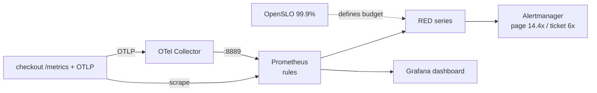

# Module: observability

> **Status:** **Validated** — the **authoritative Prometheus tooling** now runs in this
> environment and passes. `promtool check config` validates `prometheus.yml` (and loads
> both rule files), `promtool check rules` passes on **every** recording + alerting file
> (solution, starter, and the broken fixture — which is *syntactically* valid by design),
> `promtool test rules` **unit-tests the burn-rate alerts end to end** (the fast-burn alert
> fires on a sustained 5% error series and stays silent for a healthy one), and `yamllint`
> (module `.yamllint` config) is clean across all YAML. These run alongside the existing
> structural gates and the semantic burn-rate linter (accepts the solution; rejects both
> the broken fixture and the unfilled starter). `./validate.sh` runs them all and exits `0`
> here (**38 passed, 0 failed**). Only `otelcol validate` and `oslo validate` remain
> **DEFERRED** (those binaries are not installed here); commands to run them are below.
> Tooling: `promtool 2.54.1`, `yamllint 1.38.0`.
> **Maps to:** Week 16 Class 02–04 (metrics, RED method, Prometheus rules, Grafana
> dashboards) and Week 21 Class 02–03 (SLOs, error budgets, multi-burn-rate alerting,
> OpenTelemetry pipeline). Reused by `sre-incident-response` (W21/W22) and the capstone.

## What you will build

A complete, file-on-disk observability stack for a `checkout` service: a Prometheus
**scrape config**; **recording rules** that precompute the RED signals (request **R**ate,
**E**rror ratio, p99 **D**uration via `histogram_quantile`); **multi-window,
multi-burn-rate SLO alerts** (fast burn 1h+5m @ 14.4×, slow burn 6h+30m @ 6×) that
protect a 99.9% availability objective; a **valid Grafana dashboard model** with
rate/errors/latency/burn-rate panels and real PromQL targets; an **OpenTelemetry
Collector** config (OTLP in → memory_limiter → batch → resource → Prometheus/OTLP
exporters); an **OpenSLO v1** spec that is the single source of truth for the 99.9% SLO;
and a commented PromQL cookbook. You then fill the TODO'd burn-rate expressions yourself
and prove them correct against a semantic linter and a broken fixture.

## Prerequisites

- `python3 >= 3.10` with **PyYAML** (`python3 -c "import yaml"` must succeed) — drives
  every local gate. (`python3 -m json.tool` is stdlib.)
- `bash >= 5`.
- `promtool` (ships with Prometheus) and `yamllint` drive the authoritative gates and
  run automatically when present (both are installed in the validated environment).
  `otelcol-contrib` and the OpenSLO CLI `oslo` are optional (still-deferred). Install
  notes below.
- No cloud account and no running cluster are required. Nothing here costs money.
- Conceptual background: the RED method (Tom Wilkie) and the Google **SRE Workbook**
  chapter *"Alerting on SLOs"* (the source of the 14.4×/6× multi-burn-rate table).

## Architecture

See [`docs/architecture.mmd`](docs/architecture.mmd) (Mermaid). In words: the instrumented
`checkout` pods expose `/metrics` (RED counters + a latency histogram) and ship OTLP to
the **OpenTelemetry Collector**, which batches and re-exports metrics on a Prometheus
endpoint and traces to a tracing backend. **Prometheus** scrapes both, evaluates the
**recording rules** into RED series, and evaluates the **alerting rules** — the
multi-burn-rate alerts page on fast budget burn and ticket on slow burn. **Grafana**
renders the same recorded series; **`slo.yaml`** (OpenSLO) declares the 99.9% objective
those alerts defend.



## Repository layout

```
starter/    # intentionally incomplete — you fill the burn-rate + p99 TODOs here
  prometheus/prometheus.yml                 # complete (reference scrape config)
  prometheus/rules/recording.rules.yml      # p99 histogram_quantile is TODO'd
  prometheus/rules/alerting.rules.yml       # both burn-rate exprs are TODO'd
  grafana/dashboards/service-overview.json  # complete
  otel/otel-collector-config.yaml           # complete
  slo/slo.yaml                              # complete
  queries/red-method.promql                 # complete
solution/   # reference implementation — check yourself against this
  prometheus/prometheus.yml
  prometheus/rules/recording.rules.yml      # RED: rate, error ratio, p99
  prometheus/rules/alerting.rules.yml       # fast 1h/5m@14.4x, slow 6h/30m@6x
  grafana/dashboards/service-overview.json  # schemaVersion 39, 4 panels w/ targets
  otel/otel-collector-config.yaml
  slo/slo.yaml                              # OpenSLO v1, 99.9% availability
  queries/red-method.promql
tests/      # check_rules.py (semantic burn-rate linter), test_artifacts.py
            # (structural invariants), alerting_test.yaml (promtool unit test)
broken/     # alerting.rules.broken.yml — a real flawed burn-rate alert to diagnose
docs/       # architecture.mmd
validate.sh # runs every local gate; exits non-zero on any failure
```

## Setup

From a fresh clone, no install step is needed for the local gates:

```bash
cd labs/observability
python3 -c "import yaml; print('PyYAML', yaml.__version__)"   # sanity check
./validate.sh                                                # run all local gates
```

To do the lab, edit the TODO'd files under `starter/` and re-run the checker against
them (it takes explicit paths — see each task).

## Lab tasks

1. **Record the p99 latency series.**
   In `starter/prometheus/rules/recording.rules.yml`, the
   `job:http_request_duration_seconds:p99` rule is a `vector(0)` placeholder. Replace it
   with `histogram_quantile(0.99, sum by (job, le) (rate(..._bucket{job="checkout"}[5m])))`.
   **Done when:** `python3 -c "import yaml; ..."` still parses the file and the expr
   contains `histogram_quantile` and `by (job, le)`. (Dropping `le` is the classic bug.)

2. **Write the fast-burn (page) alert.**
   In `starter/prometheus/rules/alerting.rules.yml`, replace the
   `CheckoutErrorBudgetBurnFast` placeholder with a **multi-window** expression that fires
   only when BOTH `job:http_requests_error_ratio:rate1h` AND `...:rate5m` exceed
   `14.4 * 0.001`, joined with `and`.
   **Done when:** the semantic linter accepts it (see task 4).

3. **Write the slow-burn (ticket) alert.**
   Same shape with the slow thresholds: BOTH `...:rate6h` AND `...:rate30m` over
   `6 * 0.001`.
   **Done when:** the linter accepts it.

4. **Prove the alerts are correct.**
   Copy your finished file over a scratch copy and run the semantic linter:
   ```bash
   python3 tests/check_rules.py starter/prometheus/rules/alerting.rules.yml
   ```
   **Done when:** it prints `[PASS] ... valid multi-window multi-burn-rate alerts`
   (it currently `[FAIL]`s the unfilled starter on purpose).

5. **Run the full local suite.**
   **Done when:** `./validate.sh` exits `0` with every line `[PASS]`.

6. **Troubleshooting drill.** Diagnose the two faults in
   `broken/alerting.rules.broken.yml` (see Troubleshooting).
   **Done when:** you can state *why* each fault makes the alert wrong (one never fires,
   one flaps) — without editing the fixture in place.

## Why the burn-rate math is what it is

A "burn rate" is how fast you spend the error budget relative to the rate that exhausts
it exactly at the window's end. Burn rate 1 = on track to use 100% of the budget in 30
days. For a **99.9% SLO the budget is 0.001 (0.1%)**, so the alert threshold for a burn
rate *B* is `B * 0.001`. The Google SRE Workbook's recommended 30-day table:

| Severity | Long window | Short window | Burn rate | Threshold (`B*0.001`) | Budget spent when it fires |
|----------|-------------|--------------|-----------|-----------------------|----------------------------|
| page     | 1h          | 5m           | 14.4      | 0.0144                | ~2 %                       |
| ticket   | 6h          | 30m          | 6         | 0.006                 | ~5 %                       |

Two windows per alert, joined by `and`, because:
- the **long** window gives *significance* — you've really been burning for a meaningful
  period, not a 1-minute blip;
- the **short** window gives *fast reset* — when the incident ends the alert clears
  quickly instead of staying lit for the whole long window.

## Validation

`./validate.sh` runs the gates below. Real output captured in **this** environment:

```
== validating observability ==
  [PASS] yaml parses: ... (×12 rules/config/test YAML)
  [PASS] json parses: solution grafana dashboard
  [PASS] json parses: starter grafana dashboard
  [PASS] structural unit tests (unittest)
  [PASS] burn-rate linter ACCEPTS solution/alerting.rules.yml
  [PASS] burn-rate linter REJECTS broken/alerting.rules.broken.yml (expected)
  [PASS] burn-rate linter REJECTS unfilled starter (expected)
  [PASS] yamllint: ... (×12 YAML files, module .yamllint, --strict)
  [PASS] promtool check config: solution/prometheus/prometheus.yml
  [PASS] promtool check config: starter/prometheus/prometheus.yml
  [PASS] promtool check rules: broken/alerting.rules.broken.yml
  [PASS] promtool check rules: solution/prometheus/rules/alerting.rules.yml
  [PASS] promtool check rules: solution/prometheus/rules/recording.rules.yml
  [PASS] promtool check rules: starter/prometheus/rules/alerting.rules.yml
  [PASS] promtool check rules: starter/prometheus/rules/recording.rules.yml
  [PASS] promtool test rules: tests/alerting_test.yaml
  [DEFERRED] otelcol-contrib validate ...
  [DEFERRED] oslo validate ...
== 38 passed, 0 failed (plus 2 DEFERRED — see README) ==
```

Real output from the authoritative Prometheus gates in **this** environment
(`promtool 2.54.1`):

```
$ promtool check config solution/prometheus/prometheus.yml
Checking solution/prometheus/prometheus.yml
  SUCCESS: 2 rule files found
 SUCCESS: solution/prometheus/prometheus.yml is valid prometheus config file syntax
Checking solution/prometheus/rules/recording.rules.yml
  SUCCESS: 9 rules found
Checking solution/prometheus/rules/alerting.rules.yml
  SUCCESS: 3 rules found

$ promtool check rules solution/prometheus/rules/recording.rules.yml \
                       solution/prometheus/rules/alerting.rules.yml
  SUCCESS: 9 rules found
  SUCCESS: 3 rules found

$ promtool test rules tests/alerting_test.yaml
Unit Testing:  tests/alerting_test.yaml
  SUCCESS

$ yamllint -c .yamllint --strict <all module YAML>      # (no output = clean)
```

### Gate commands

| Gate | Command (this repo) | Status here |
|------|---------------------|-------------|
| YAML well-formed (all rules/configs) | `python3 -c "import yaml,sys; list(yaml.safe_load_all(open(F)))"` | PASS |
| Grafana dashboard JSON well-formed | `python3 -m json.tool < solution/grafana/dashboards/service-overview.json` | PASS |
| Dashboard model valid (schemaVersion, panels, targets w/ expr) | `python3 -m unittest discover -s tests` | PASS |
| RED recording rules present; p99 uses `histogram_quantile … by (job, le)` | `python3 -m unittest discover -s tests` | PASS |
| Burn-rate alerts multi-window, 14.4×/6×, budget-relative threshold | `python3 -m unittest discover -s tests` + `tests/check_rules.py` | PASS |
| OpenSLO v1, 99.9% objective, Prometheus ratio metric | `python3 -m unittest discover -s tests` | PASS |
| Broken fixture is rejected | `! python3 tests/check_rules.py broken/alerting.rules.broken.yml` | PASS |
| **YAML style/structure (all rules/configs)** | `yamllint -c .yamllint --strict <files>` | **PASS** |
| **Prometheus config valid (loads rule files)** | `promtool check config solution/prometheus/prometheus.yml` | **PASS** |
| **Every recording + alerting rules file valid** | `promtool check rules <each .yml>` | **PASS** |
| **Burn-rate alerts behave (fire on 5% errors, silent when healthy)** | `promtool test rules tests/alerting_test.yaml` | **PASS** |

The four bolded rows were previously DEFERRED; they now run as part of `./validate.sh`,
each guarded by `command -v <tool>` so the module still validates where the tool is absent.

### yamllint configuration

`yamllint` runs against the module's [`.yamllint`](.yamllint), which extends the strict
`default` preset with two **documented, narrow** relaxations: `line-length` is raised to
120 and demoted to a warning (these are teaching files with long explanatory comments),
and `document-start` (`---`) is disabled (Prometheus/OTel configs conventionally omit it).
Verified: with only those two rules relaxed, `yamllint` reports **zero** findings, so no
substantive style/structure problem is being suppressed. All YAML passes `--strict`.

### Still-DEFERRED gates — exact commands to run where the tool exists

Only the OpenTelemetry and OpenSLO validators remain uninstalled here (confirmed via
`command -v otelcol-contrib` / `command -v oslo` → not found):

```bash
# OpenTelemetry Collector config validation (contrib distro):
otelcol-contrib validate --config solution/otel/otel-collector-config.yaml

# OpenSLO spec validation:
oslo validate -f solution/slo/slo.yaml

# Grafana dashboard: import via API or `grafana-cli`; or lint with the dashboard
# JSON schema. A quick provisioning smoke test:
#   docker run -d -p 3000:3000 -v "$PWD/solution/grafana:/var/lib/grafana/dashboards" grafana/grafana
```

Install the remaining tools:
```bash
# otelcol-contrib: https://github.com/open-telemetry/opentelemetry-collector-releases/releases
# oslo: https://github.com/OpenSLO/oslo  (go install github.com/OpenSLO/oslo@latest)
# (promtool 2.54.1 and yamllint 1.38.0 are installed here and run automatically.)
```

## Expected results

- `./validate.sh` exits `0`; every line is `[PASS]` (plus the 2 remaining `[DEFERRED]`
  notes for `otelcol`/`oslo`).
- `tests/check_rules.py` prints `[PASS]` for the solution and `[FAIL]` (with the two
  faults named) for `broken/alerting.rules.broken.yml`.
- `promtool check rules` → `SUCCESS: N rules found`; `promtool test rules
  tests/alerting_test.yaml` → `SUCCESS` (the fast-burn alert fires at the 5% error series
  and stays silent for the healthy series). These run automatically in `validate.sh`.
- In Grafana: importing `service-overview.json` yields 4 panels — Request rate, Error
  ratio (red above the 0.1% budget line), Latency p50/p95/p99 (red above 500ms), and a
  burn-rate stat that goes orange at 6× / red at 14.4×.

## Troubleshooting

Reproducible broken state ships in
[`broken/alerting.rules.broken.yml`](broken/alerting.rules.broken.yml). It passes
`promtool check rules` (it is syntactically valid) but is **semantically wrong** — the
kind of bug that pages you at 3 a.m. for nothing or, worse, never pages at all.

| Symptom | Cause | Fix |
|---------|-------|-----|
| `tests/check_rules.py broken/alerting.rules.broken.yml` prints `[FAIL]` with *"not multi-window — no `and`"*. | The fast-burn alert checks only the **5m** window. A 5-minute transient (one bad deploy that auto-rolls-back) pages on-call needlessly. | Join the 5m check with the **1h** window using `and`, so the long window confirms the burn is real before paging. |
| Same file: *"threshold `> 14.4` is an absolute number … a ratio can never exceed it"*. | The threshold is `14.4` instead of `14.4 * 0.001`. The recorded error **ratio** is in `[0, 1]`, so the alert can **literally never fire**. | Multiply the burn rate by the 0.1% budget: `> 14.4 * 0.001` (= 0.0144). |
| `promtool check rules` is green but the page never arrives in prod. | Both faults above are *semantic*, not syntactic — `promtool check rules` only checks syntax. | Add `promtool test rules` (see `tests/alerting_test.yaml`) to CI so the alert's *behavior* is tested, not just its grammar. |
| Grafana panel for error ratio shows gaps. | `errors/total` is `0/0` when there is no traffic — Prometheus yields no sample, rendered as a gap. | Expected, not a bug. Don't paper over it with `or vector(0)`, which would hide real outages where the target is down. |
| `histogram_quantile` returns absurd values (e.g. negative or huge). | The bucket rate was summed without `by (le)`, or `_bucket` series weren't `rate()`d first. | Always `histogram_quantile(0.99, sum by (job, le) (rate(..._bucket[5m])))`. |

## Cleanup

Local-only. The lab creates **no** cloud or cluster resources and **no** running
processes by default. To tidy generated bytecode:

```bash
find . -name '__pycache__' -type d -prune -exec rm -rf {} +
```

If you ran the optional Grafana docker smoke test, stop it:

```bash
docker ps --filter ancestor=grafana/grafana -q | xargs -r docker rm -f
```

Nothing else persists; there is no `terraform destroy` / `kubectl delete` to run because
this module ships configuration files, not a live deployment.

## Security considerations

- **No secrets in these files.** The OTel exporter endpoints and Alertmanager target are
  in-cluster service DNS names, not credentials. In production, put backend tokens/TLS in
  a secret manager and reference them via env vars (`${OTLP_TOKEN}`), never inline.
- **`tls.insecure: true`** in the OTel config is for the self-contained lab only — turn
  on TLS (`tls.insecure: false` + CA/cert) for any real exporter.
- **Least exposure.** The collector's receivers bind `0.0.0.0` so the lab works in a
  container; in production restrict to the pod network / a NetworkPolicy and don't expose
  `:4317/:4318/:8889` publicly.
- **Don't commit** real Grafana API keys, Alertmanager webhook URLs (Slack/PagerDuty
  routing keys are secrets), or org-specific runbook URLs that leak internal hostnames.
- **Alert hygiene is a safety control:** a soft/never-firing alert (the broken fixture)
  is a security/reliability risk — it gives false assurance. The `promtool test rules`
  gate is how you keep alerts honest.

## Cost considerations

- **This module: $0.** It is configuration and tests on disk; the local gates run
  entirely on your machine with no network calls.
- In a real deployment the cost drivers are **metric cardinality** (each unique label set
  is a time series you store and query) and **retention**. This is why the scrape config
  `drop`s high-cardinality Go runtime histograms and why the rules `sum by (job[, route])`
  rather than keeping per-pod series in dashboards. Recording rules also *reduce* query
  cost by precomputing expensive `histogram_quantile`s once per evaluation interval.
- A self-managed Prometheus + Grafana + OTel Collector stack on a small node is a few
  dollars/month of compute; managed offerings (Grafana Cloud, AMP) bill per active series
  / sample ingested — keep cardinality low to stay cheap. **Stay at $0** by doing the lab
  locally (no stack is required to validate the artifacts).

## Instructor answer key

Reference implementation: [`solution/`](solution/). Grading points that separate a real
pass from a plausible-looking one:

- **Burn-rate alerts are multi-window.** Both `CheckoutErrorBudgetBurnFast` (1h `and`
  5m) and `CheckoutErrorBudgetBurnSlow` (6h `and` 30m) must combine two windows. A single
  window is the most common wrong answer — it pages on blips. `tests/check_rules.py`
  encodes this.
- **Thresholds are budget-relative.** `14.4 * 0.001` and `6 * 0.001`, **not** bare
  `14.4`/`6`. A learner who writes `> 14.4` against a ratio series has built an alert that
  can never fire — the exact Fault 2 in the broken fixture.
- **p99 uses `histogram_quantile` with `by (job, le)`.** Dropping `le`, or quantiling the
  raw `_bucket` counter without `rate()`, yields nonsense. `test_artifacts.py` checks for
  `by (job, le)`.
- **Recording rules and alerts share one definition of "error".** The alerts consume
  `job:http_requests_error_ratio:rateXX`; they must not re-derive the ratio inline (that
  invites drift between dashboard and alert).
- **OpenSLO objective is `0.999`** and the SLI is a Prometheus ratio of non-5xx to total.
  A wrong answer hardcodes `99.9` (a percent, not a fraction) or uses a latency metric for
  an availability SLO.
- **Grafana JSON is a real dashboard *model*** (top-level `schemaVersion`, `panels`, each
  panel with `targets[].expr`), not a fragment. Pasting a single panel, or omitting
  `schemaVersion`, fails the import.

Troubleshooting fixture `broken/alerting.rules.broken.yml` has **two** injected faults
(single-window + absolute threshold); a complete answer names both and explains why
`promtool check rules` passes it anyway (syntax-only) while `promtool test rules` would
catch the behavior — the lesson that alerts need *behavioral* tests, not just linting.
The `promtool test rules` unit test lives at `tests/alerting_test.yaml`.
