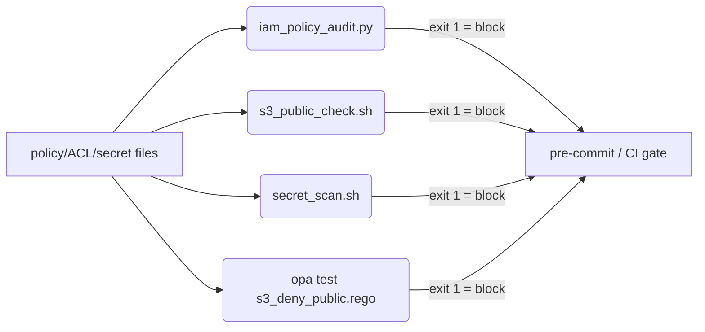

# Module: security-automation

> **Status:** Validated — every gate in `./validate.sh` was run in THIS environment
> and passed: `bash -n` on all 4 `.sh` files, `py_compile` on all 3 `.py` files,
> `python3 -m unittest` (14 tests, `OK`) against `solution/`, JSON well-formedness on
> all 7 policy/fixture JSONs, the behavioural gates (the IAM auditor flags
> `bad-policy.json` with exit 1 and passes `good-policy.json` with exit 0; the S3 check
> flags a public policy/ACL; `secret_scan.sh` finds the planted key in `broken/`), and
> the **policy-as-code gates with the real tools**: `opa test` is 5/5 PASS on the rego,
> and `conftest test` denies the public bucket policy (exit 1) while allowing the private
> one (exit 0). Tool versions here: `opa 0.68.0`, `conftest 0.55.0`.
> **24 passed, 0 failed, 0 deferred.** (Both `opa` and `conftest` gates are guarded by
> `command -v` in `validate.sh`, so they auto-run where the tool exists and DEFER
> gracefully where it does not.)
> **Maps to:** Week 06 Class 02–03 (cloud security fundamentals — least privilege, public
> exposure, secret hygiene) and **reused in Week 19 Class 02–03** (wiring these checks as
> CI gates and policy-as-code in the pipeline). The `iam_policy_audit.py` pure-function
> pattern mirrors `labs/python-automation`.

## What you will build
A small **shift-left security toolkit** that catches the three most common cloud
misconfigurations *before* they ship, with no SaaS scanner and no AWS account needed for
the lab itself:

1. `iam_policy_audit.py` — loads an IAM policy JSON and **flags over-broad grants**:
   wildcard `Action` (`"*"`, `"s3:*"`), over-broad `Resource` (`"*"`, `"arn:aws:s3:::*"`),
   and `NotAction`/`NotResource`. Pure-function core (`audit_policy`) + a CLI that exits
   non-zero so it can **fail a pipeline** (`--fail-on any|high|never`).
2. `s3_public_check.sh` — given a bucket **policy** or **ACL** JSON, detects public grants
   (`Principal "*"`, or ACL grants to `AllUsers`/`AuthenticatedUsers`).
3. `secret_scan.sh` — greps a directory tree or **git-staged** files for high-signal
   credential patterns (AWS keys, PEM private keys, GitHub tokens, password assignments);
   wireable as a pre-commit hook.
4. **Policy-as-code**: `policies/opa/s3_deny_public.rego` (+ passing/failing test rego),
   `policies/iam/{good,bad}-policy.json`, and an org guardrail
   `policies/scp/deny-leave-org.json`.

End state: `./validate.sh` is green (24 gates pass, 0 deferred — `opa test` and
`conftest test` now run with the real tools), and each tool runs against real artifacts
producing the captured output shown below.

## Prerequisites
- `python >= 3.10` (uses `X | None` and `list[...]`/`dict[...]` generics). This env: 3.10.12.
- `bash >= 4` and standard `grep`/`find` (GNU). No AWS account, no boto3, no network for
  the lab or the tests — everything is offline and fixture-driven.
- For the policy-as-code gate: `opa >= 0.50` and/or `conftest`. Both are installed here
  (`opa 0.68.0`, `conftest 0.55.0`) and run in `validate.sh`; where absent the gate DEFERs.
- Optional, for the "real tool" comparisons in Troubleshooting: `gitleaks`, AWS
  `iam-policy-validator` / Access Analyzer, `checkov`. None required to complete the lab.
- Prior modules: none required. Complements `labs/python-automation` (pure-function +
  CLI pattern) and feeds `labs/cicd-pipelines` (Week 19 — these become CI jobs).

## Architecture
See [`docs/architecture.mmd`](docs/architecture.mmd) (Mermaid). In words: three independent
scanners read **policy/ACL/secret artifacts as plain files** and exit non-zero on a
violation. On a developer machine, `secret_scan.sh` runs as a pre-commit hook and blocks
the commit. In CI (Week 19), `iam_policy_audit.py`, `s3_public_check.sh`, and `opa test`
run against the policy files in the change and **fail the build** when a grant is
over-broad or public. The SCP (`deny-leave-org.json`) is an org-root *guardrail* — it is
shown as a reference artifact, not scanned (a wildcard inside a `Deny` is intentional).



## Repository layout
```
solution/
  iam_policy_audit.py          # reference: pure audit_policy() + CLI
  s3_public_check.sh           # reference: public Principal / ACL detection
  secret_scan.sh               # reference: credential-pattern scanner
  policies/
    iam/good-policy.json       # clean least-privilege policy (0 findings)
    iam/bad-policy.json        # wildcard + NotAction (6 findings)
    opa/s3_deny_public.rego        # deny public S3 bucket policy
    opa/s3_deny_public_test.rego   # passing + failing fixtures (opa test)
    opa/fixtures/*.json            # public/private bucket policy + ACL fixtures
    scp/deny-leave-org.json    # org guardrail (reference; not scanned)
starter/                       # SAME tree, key detection logic TODO'd:
  iam_policy_audit.py          #   _has_wildcard + _resource_is_overbroad + 2 finding blocks
  s3_public_check.sh           #   principal_is_public() TODO
  secret_scan.sh               #   PATTERNS table TODO
tests/
  test_iam_policy_audit.py     # 14 stdlib unittest cases (good+bad fixtures)
broken/
  leaky_config.env             # planted (fake) AWS key for the secret-scan exercise
docs/architecture.mmd
validate.sh                    # runs every gate; exits non-zero on any failure
```

## Setup
From a fresh clone, no install step is needed:
```bash
cd labs/security-automation
chmod +x validate.sh solution/*.sh starter/*.sh   # already +x in the repo
./validate.sh                                      # 24 pass, 0 fail, 0 deferred
```
Do the lab in `starter/`; check yourself against `solution/`.

## Lab tasks
Work in `starter/`. Each task has a **done when** check you can run.

1. **Detect Action wildcards.** Complete `_has_wildcard` in
   `starter/iam_policy_audit.py` and the `WILDCARD_ACTION` finding block in
   `audit_statement`.
   *Done when:* `PYTHONPATH=starter python3 solution/iam_policy_audit.py` … no — run
   `cd starter && python3 iam_policy_audit.py policies/iam/bad-policy.json` flags the
   `s3:*` and `*` actions.

2. **Distinguish over-broad vs scoped Resources.** Complete `_resource_is_overbroad`
   (and the `WILDCARD_RESOURCE` block). The subtlety: `arn:aws:s3:::my-bucket/*` is
   **least privilege** (objects in one named bucket) and must **not** be flagged, but
   `arn:aws:s3:::*` and `"*"` must be.
   *Done when:* the auditor flags `bad-policy.json` (6 findings) and passes
   `good-policy.json` (0 findings).

3. **Make the IAM tests pass.** *Done when:*
   `cd .. && PYTHONPATH=starter python3 -m unittest discover -s tests` prints `OK`.

4. **Detect public S3 Principals.** Complete `principal_is_public()` in
   `starter/s3_public_check.sh`.
   *Done when:* `bash starter/s3_public_check.sh policy
   solution/policies/opa/fixtures/public-bucket-policy.json` exits 1 and the private
   fixture exits 0.

5. **Write the secret patterns.** Fill the `PATTERNS` table in
   `starter/secret_scan.sh` (AWS key id, PEM header, password assignment).
   *Done when:* `bash starter/secret_scan.sh dir broken` finds the planted key (exit 1)
   and `bash starter/secret_scan.sh dir solution` is clean (exit 0).

6. **Run the full gate.** *Done when:* `./validate.sh` exits 0 (after you copy your
   completed files over, or just confirm `solution/` stays green).

## Validation
`./validate.sh` runs all gates below. Captured output from THIS environment:

```
== validating security-automation ==
  [PASS] bash -n: solution/s3_public_check.sh
  [PASS] bash -n: solution/secret_scan.sh
  [PASS] bash -n: starter/s3_public_check.sh
  [PASS] bash -n: starter/secret_scan.sh
  [PASS] py_compile: all .py files (syntax)
  [PASS] unittest: solution passes IAM auditor tests
  [PASS] starter is incomplete (tests fail until TODOs are done)
  [PASS] json.tool: solution/policies/iam/bad-policy.json
  [PASS] json.tool: solution/policies/iam/good-policy.json
  [PASS] json.tool: solution/policies/opa/fixtures/private-bucket-policy.json
  [PASS] json.tool: solution/policies/opa/fixtures/public-bucket-acl.json
  [PASS] json.tool: solution/policies/opa/fixtures/public-bucket-policy.json
  [PASS] json.tool: solution/policies/scp/deny-leave-org.json
  [PASS] iam_policy_audit flags bad-policy.json (exit 1)
  [PASS] iam_policy_audit passes good-policy.json (exit 0)
  [PASS] s3_public_check flags public bucket policy (exit 1)
  [PASS] s3_public_check passes private bucket policy (exit 0)
  [PASS] s3_public_check flags public bucket ACL (exit 1)
  [PASS] secret_scan finds planted key in broken/ (exit 1)
  [PASS] secret_scan is clean on solution/ (exit 0)
  [PASS] opa rego: package line + test_ rules present (structural)
  [PASS] opa test: s3_deny_public rego (5/5 tests pass)
  [PASS] conftest: public bucket policy is DENIED (bad fails) (exit 1)
  [PASS] conftest: private bucket policy is ALLOWED (good passes) (exit 0)
== 24 passed, 0 failed, 0 deferred ==
```

**Gate-by-gate, with the exact command:**

| # | Gate | Command | Result |
|---|------|---------|--------|
| 1 | shell syntax | `bash -n solution/*.sh starter/*.sh` | PASS |
| 2 | python syntax | `python3 -m py_compile solution/*.py starter/*.py tests/*.py` | PASS |
| 3 | IAM auditor tests | `PYTHONPATH=solution python3 -m unittest discover -s tests` | PASS (14 tests, OK) |
| 4 | starter is incomplete | starter tests must FAIL | PASS (4 failures, 3 errors) |
| 5 | policy JSON well-formed | `python3 -m json.tool < <each>.json` | PASS (7 files) |
| 6 | IAM behaviour | `python3 solution/iam_policy_audit.py solution/policies/iam/bad-policy.json` → exit 1; good → exit 0 | PASS |
| 7 | S3 behaviour | `solution/s3_public_check.sh policy/acl <fixture>` | PASS |
| 8 | secret behaviour | `solution/secret_scan.sh dir broken` → exit 1; `dir solution` → exit 0 | PASS |
| 9a | **OPA rego (structural)** | `package`/`test_` lines present | PASS |
| 9b | **OPA policy** | `opa test solution/policies/opa/*.rego` | PASS (5/5 tests) |
| 9c | **conftest (bad fails)** | `conftest test … public-bucket-policy.json` | PASS (exit 1, 1 failure) |
| 9d | **conftest (good passes)** | `conftest test … private-bucket-policy.json` | PASS (exit 0, 1 passed) |

**§9 OPA / conftest — RUN HERE with the real tools (`opa 0.68.0`, `conftest 0.55.0`):**

`opa test` is pointed at the two `.rego` files, **not** the `opa/` directory. Pointing it
at the directory makes OPA load the JSON conftest fixtures as `data` documents, and the two
bucket-policy fixtures share top-level keys (`Version`/`Statement`) → `merge error`. The
fixtures are conftest *inputs*, not OPA data, so we keep them out of the load.
```text
$ opa test solution/policies/opa/s3_deny_public.rego \
           solution/policies/opa/s3_deny_public_test.rego -v
solution/policies/opa/s3_deny_public_test.rego:
data.s3.deny_public.test_deny_principal_star: PASS (1.154181ms)
data.s3.deny_public.test_deny_principal_aws_star: PASS (567.859µs)
data.s3.deny_public.test_deny_principal_aws_list_with_star: PASS (421.708µs)
data.s3.deny_public.test_allow_scoped_principal: PASS (346.425µs)
data.s3.deny_public.test_allow_public_principal_but_deny_effect: PASS (336.864µs)
--------------------------------------------------------------------------------
PASS: 5/5
```

`conftest` enforces the same rego against real bucket-policy JSON. The rule lives in
package `s3.deny_public`, so conftest needs `--namespace` (its default namespace is
`main`). The **bad** fixture is denied (exit 1); the **good** one passes (exit 0):
```text
$ conftest test --policy solution/policies/opa --namespace s3.deny_public \
    solution/policies/opa/fixtures/public-bucket-policy.json
FAIL - solution/policies/opa/fixtures/public-bucket-policy.json - s3.deny_public \
  - S3 statement Sid=PublicReadGetObject allows public access (Principal '*')
1 test, 0 passed, 0 warnings, 1 failure, 0 exceptions      # exit 1

$ conftest test --policy solution/policies/opa --namespace s3.deny_public \
    solution/policies/opa/fixtures/private-bucket-policy.json
1 test, 1 passed, 0 warnings, 0 failures, 0 exceptions     # exit 0
```
Both gates are guarded by `command -v` in `validate.sh` so they auto-run where the tool is
installed and DEFER (printing the exact command) where it is not. You can also evaluate a
raw policy against the rule directly:
```bash
opa eval -d solution/policies/opa/s3_deny_public.rego \
  -i solution/policies/opa/fixtures/public-bucket-policy.json \
  'data.s3.deny_public.deny'    # -> non-empty set => violation
```

## Expected results
- `iam_policy_audit.py` on `bad-policy.json` (exit 1):
  ```
  6 finding(s):
    [HIGH] WILDCARD_ACTION (Sid=AdminEverything): Allow statement grants wildcard Action "*"
    [HIGH] WILDCARD_RESOURCE (Sid=AdminEverything): Allow statement grants over-broad Resource "*"
    [MEDIUM] WILDCARD_ACTION (Sid=AllS3AnyBucket): Allow statement grants wildcard Action "s3:*"
    [MEDIUM] WILDCARD_RESOURCE (Sid=AllS3AnyBucket): Allow statement grants over-broad Resource "arn:aws:s3:::*"
    [HIGH] WILDCARD_RESOURCE (Sid=EverythingExceptIam): Allow statement grants over-broad Resource "*"
    [MEDIUM] NOT_ACTION (Sid=EverythingExceptIam): Allow statement uses NotAction: grants every action EXCEPT ['iam:*'] ...
  ```
- On `good-policy.json` (exit 0): `OK: no wildcard or NotAction/NotResource grants found.`
  Note the good policy contains a `Deny "*"/"*"` guardrail that is correctly **not** flagged.
- `s3_public_check.sh policy <public>` (exit 1): `PUBLIC bucket policy: 1 public Allow statement(s)`.
- `secret_scan.sh dir broken` (exit 1): `FAIL: N likely secret(s) found ...` listing the
  AWS Access Key ID and PEM/password matches in `broken/leaky_config.env`.

## Troubleshooting
Real, reproducible failures using the `broken/` fixture and the design's sharp edges.

| Symptom | Cause | Fix |
|---------|-------|-----|
| `secret_scan.sh dir broken` exits 0 (no hit) | In the **starter**, the `PATTERNS` table only has the example GitHub-token row; the AWS-key/PEM/password rows are still `TODO`. | Add the rows (label`<TAB>`ERE) per the comment. The TAB matters — `IFS=$'\t'` splits on it. |
| Auditor flags `arn:aws:s3:::my-bucket/*` as over-broad | A naive implementation flags *any* `*` in a Resource. | Use `_resource_is_overbroad`: only the **resource-id** portion (after the 5th `:`) starting with `*`/`?` is over-broad. A trailing object-key wildcard on a **named** bucket is least-privilege. |
| `opa test` "package … not found" | Test file's `package` line doesn't match the policy's. | Both files must be `package s3.deny_public`. |
| `secret_scan.sh staged` says "not inside a git work tree" | Run outside a repo, or `git` absent. | Run from within the cloned repo; the hook form only makes sense there. |
| Auditor returns exit 0 on a clearly-bad policy via `--fail-on high` | A policy whose only issues are MEDIUM (e.g. `s3:*` scoped). `--fail-on high` gates on HIGH only. | Use the default `--fail-on any` in CI to block MEDIUM findings too. |

**Known limitation (honest):** the Resource check only catches a wildcard that *begins*
the resource-id (`"*"`, `arn:aws:s3:::*`). A `type/*` id such as
`arn:aws:ec2:...:instance/*` ("every instance") is **not** flagged — distinguishing a
resource *type* prefix from a resource *name* is service-specific. For full coverage use
AWS IAM Access Analyzer policy validation / `checkov`; this lab teaches the mechanism, not
exhaustive coverage.

## Cleanup
Nothing is provisioned — no cloud resources, no running processes, no money spent. To
return to a pristine tree:
```bash
cd labs/security-automation
find . -name '__pycache__' -type d -prune -exec rm -rf {} +   # remove py bytecode caches
rm -f /tmp/_sec_check.out /tmp/_sec_starter.out /tmp/_secret_hits.out /tmp/_lab_check.out
git checkout -- starter/   # discard your in-progress edits if you want to start over
```
The `broken/leaky_config.env` credential is **fake** (the canonical AWS documentation
example key, not live) — nothing to rotate. It is safe to keep in the repo.

## Security considerations
- **This toolkit reduces risk; it does not eliminate it.** It is a teaching-grade
  shift-left layer, not a replacement for AWS GuardDuty / Access Analyzer / a real secret
  scanner (gitleaks, trufflehog). Document that to learners.
- **Never commit real secrets**, even to test a scanner. `broken/leaky_config.env` uses
  the published AWS *example* credentials precisely so no real key is exposed. Real keys
  belong in a secrets manager (AWS Secrets Manager / SSM Parameter Store / Vault), not in
  files. If a real key is ever committed, **rotate it immediately** — deleting the commit
  is not enough; it is in the reflog/forks.
- **Least privilege:** the `good-policy.json` shows the target shape — named resource ARNs,
  scoped actions, a region-pinned `Deny` guardrail. The auditor is the gate that keeps a
  policy there.
- **Wildcards in `Deny` are fine** and the auditor deliberately ignores them — a broad
  `Deny` is a guardrail (see the SCP and the good-policy's deny statement).
- The scanners read files only; they never exfiltrate. `secret_scan.sh` writes one temp
  file (`/tmp/_secret_hits.out`) it controls; review before adapting for CI artifacts.

## Cost considerations
**$0.** Everything in this module runs locally on bash + python3 against static fixture
files. No AWS account, no API calls, no data transfer, no SaaS scanner subscription. When
you wire these into CI (Week 19) the only cost is CI runner minutes, which for these
sub-second checks is negligible. `opa` and `conftest` are free open-source binaries
(installed here and run by `validate.sh`).

## Instructor answer key
Reference implementation: [`solution/`](solution/). Grade against `./validate.sh` (must be
24 PASS / 0 DEFERRED where `opa`+`conftest` are installed). Non-obvious grading points and
common wrong answers:

1. **Resource wildcard nuance (Task 2) is the discriminator.** A student who flags
   `arn:aws:s3:::my-bucket/*` as a finding has the *naive* implementation and will fail
   `good-policy.json` (it would report a false positive). Correct answers implement
   `_resource_is_overbroad` keyed on the **resource-id segment**, not "any `*`". This is
   the single most common wrong answer.
2. **Deny statements must be ignored.** A student whose auditor flags the good-policy's
   `Deny "*"/"*"` guardrail has missed the `Effect == "Allow"` guard. Check `good-policy`
   returns **zero** findings.
3. **Action wildcards: any `*` counts.** Unlike resources, `s3:*` *should* be flagged
   (MEDIUM). A student who only flags literal `"*"` for actions under-reports.
4. **Secret scanner TAB separator.** The `PATTERNS` here-doc fields are TAB-separated and
   read with `IFS=$'\t'`. Spaces instead of a tab silently break the split — a frequent bug.
5. **Severity mapping:** literal `"*"` → HIGH; scoped (`s3:*`, `arn:aws:s3:::*`) → MEDIUM;
   `NotAction`/`NotResource` → MEDIUM. `--fail-on high` should let a MEDIUM-only policy pass.
6. **OPA:** `deny` is a **set**; an empty set means compliant. The two passing fixtures
   (scoped principal; public principal under `Deny`) prove the rule doesn't over-match.

### Class Artifacts & Validation
| # | Path | Type | What it is | Validation command | Result |
|---|------|------|-----------|--------------------|--------|
| 1 | `labs/security-automation/solution/iam_policy_audit.py` | python | IAM wildcard/NotAction auditor (pure + CLI) | `PYTHONPATH=solution python3 -m unittest discover -s tests` | PASS (14 tests, OK) |
| 2 | `labs/security-automation/solution/s3_public_check.sh` | shell | S3 public policy/ACL detector | `bash -n` + behavioural (exit 1 on public) | PASS |
| 3 | `labs/security-automation/solution/secret_scan.sh` | shell | credential-pattern scanner | `bash -n` + finds planted key in `broken/` | PASS |
| 4 | `labs/security-automation/solution/policies/iam/bad-policy.json` | json | wildcard+NotAction fixture | `python3 -m json.tool` + auditor flags 6 | PASS |
| 5 | `labs/security-automation/solution/policies/opa/s3_deny_public.rego` | rego | deny public S3 bucket policy | `opa test solution/policies/opa/*.rego` + `conftest test --namespace s3.deny_public <fixture>` | PASS (opa 5/5; conftest denies bad, allows good) |
| 6 | `labs/security-automation/solution/policies/scp/deny-leave-org.json` | json | org guardrail SCP | `python3 -m json.tool` | PASS |
